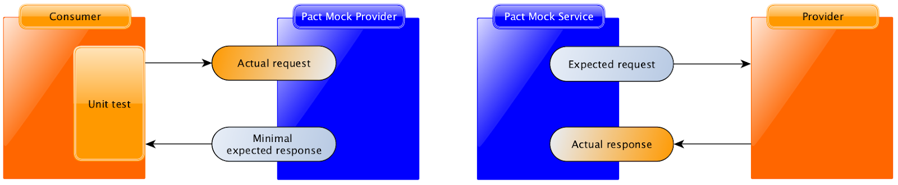
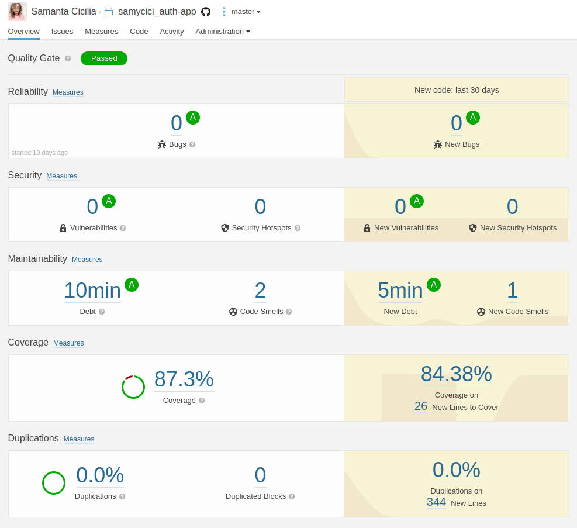

## Definindo Testes

Existem muitas definições na literatura sobre quais testes criar e onde, uma das mais famosas é a  pirâmide de testes citada pelo [Martin Fowler](https://martinfowler.com/articles/practical-test-pyramid.html). Nessa visão a ideia é que você tenha mais testes na base da pirâmide (testes unitários) que são mais rápidos de executar, um pouco menos no meio (testes integrados) e menos ainda no topo (testes de interface e manuais).

No nosso contexto eu vou usar a categorização feita pelo Google, que pode ser conferida no livro [Software Engineering at Google](https://www.amazon.com.br/Software-Engineering-Google-Titus-Winters/dp/1492082791). O Google utiliza dois critérios para categorizar os testes: tamanho e escopo.

Tamanho tem relação com a quantidade de recursos consumidos pelo teste e escopo tem relação com quanto código aquele teste está validando.

Eu acredito que essa é uma abordagem melhor para falar sobre teste já que pode ser aplicada a qualquer que seja o tipo do projeto: monolitos, microsserviços, micro frontends, etc, e não fica preso a quantidade de testes que você precisa ter em cada uma das camadas. Utilizando esse conceito você se desprende um pouco daquela pressão de seguir a pirâmide e consegue ter uma outra visão para analisar que testes fazem sentido para você.

São 3 as categorizações:

- Pequeno: são os testes mais contidos, geralmente são utilizados dublês de teste para evitar chamadas externas às funções testadas. São testes rápidos e determinísticos;
- Médio: aqui temos testes que executam múltiplos processos mas ainda assim sem acessar componentes externos, nessa categoria entram os testes que acessam banco de dados por exemplo;
- Grande: esses testes são os que necessitam de uma maior complexidade para execução, nesse momento os sistemas já estão integrados. São mais lentos e menos determinísticos.

Dentro de cada um desses tipos de teste podemos ainda categorizar quais características de qualidade estão sendo avaliadas em funcionais e não funcionais. Quando falarmos de **testes funcionais** nos referimos à validação de características relacionadas ao comportamento da aplicação durante a utilização do sistema; quando falarmos de **testes não funcionais**, nos referimos à avaliação de aspectos de qualidade como desempenho, usabilidade, compatibilidade e outras "idades" onde o objetivo é validar essas características ao invés da funcionalidade em si.

### Testes Pequenos

#### Testes Unitários

Testes Unitários são aqueles que tem um escopo mais limitado, normalmente uma simples classe ou método. Esses testes são os que vão te ajudar no dia a dia do processo de desenvolvimento já que eles são mais rápidos de executar, devido ao escopo mais contido. Isso ajuda a otimizar a produtividade dado que esses testes podem ser executados antes de fazer o push para o repositório.

Imagine a seguinte função onde, dependendo do idioma informado, você receberá como se escreve Paulo nesse idioma:

```javascript
# handler.js
function getNameAccordingLanguage(language) {
  switch(language) {
    case "en":
      return "Paul";
    case "pt":
      return "Paulo";
    case "el":
      return "Πάολο";
    default:
      return "👨🏿";
  }
}
module.exports.getNameAccordingLanguage = getNameAccordingLanguage;
```

E aqui temos um teste unitário que valida apenas o escopo dessa função, testando cada um dos idiomas contidos na função anterior `en-pt-el`, e um teste onde informamos um idioma inexistente para testar o resultado da condição default:

```javascript
# __tests__/handler.test.js
const handler = require('../handler');

test('Name is informed based on Language', () => {
  expect(handler.getNameAccordingLanguage("en")).toBe("Paul");
  expect(handler.getNameAccordingLanguage("pt")).toBe("Paulo");
  expect(handler.getNameAccordingLanguage("el")).toBe("Πάολο");
  expect(handler.getNameAccordingLanguage("bla")).toBe("👨🏿");
});
```

Esse é um teste que tem o escopo limitado, nesse caso testar que dada uma entrada, nesse caso o idioma, recebemos como resultado o nome "Paulo" de acordo com cada idioma.

Esses testes ajudam muito na manutenibilidade posto que como exercitam um escopo mais contido, se um deles quebra você consegue rapidamente identificar o ponto de falha, diferente de um caso onde, por exemplo, você tivesse mais elementos envolvidos como um banco de dados, um container da aplicação, etc.

No decorrer desse tópico vamos falar mais sobre isso, mas vale já começar a reforçar que os testes precisam trazer segurança para o time fazer o deploy em produção sem peso na consciência. Se os testes não revelam os bugs ou se quebram demais desnecessariamente o time acaba perdendo a confiança e a crença de que os testes são um elemento importante no processo de desenvolvimento. Por isso você deve tratar testes como trata código de produção: utilizando boas práticas, fazendo refatoração para implementar melhorias e sempre buscando otimização.

Não tem como falar de testes unitários sem tocar no assunto de dublês de teste, que é o que vamos abordar no próximo tópico.

#### Dublês de Testes

Como vimos a ideia dos testes unitários é ter um escopo mais limitado, mas como fazer isso se normalmente nossas funções acionam outros componentes como o próprio banco de dados, outras funções ou até mesmo sistemas externos?

É aí que entra o conceito de dublês de teste, uma forma de substituir esses componentes que são externos ao objetivo do nosso teste. Outro benefício de utilizar dublês é otimizar o tempo de execução dos testes.

Vamos utilizar o seguinte código como exemplo e o método que será testado é o getPokemon que retorna um pokemon cadastrado no banco de dados:

```javascript
const Database = {
  find() {}
}

class PokemonsController {
  constructor(Database) {
    this.Database = Database;
  }

  getPokemon() {
    return this.Database.find('pokemon');
  }
}
```

Os dublês podem ser categorizados em alguns patterns:

##### Fake

Os fakes possuem uma resposta fixa, independente de como são chamados, podem ser implementados através de uma classe ou função. Uma vantagem de usar fake é que você não precisa ter nenhuma dependência externa como uma biblioteca, mas por outro lado você só consegue validar a saída e não todo o fluxo de comportamento.

```javascript
describe('PokemonsController getPokemon()', () => {
  it('should return a Pokemon', () => {
    const databaseResponse = {
      id: 1,
      name: 'Pikachu',
      species: 'mouse',
      type: 'eletric'
    };

    const fakeDatabase = {
      find() {
        return databaseResponse;
      }
    }
    const pokemonsController = new PokemonsController(fakeDatabase);
    const response = pokemonsController.getPokemon();

    expect(response).to.be.eql(databaseResponse);
  });
});
```

No exemplo acima criamos um fake que vai sempre retornar as informações do Pikachu quando for chamado dentro do teste, ou seja, ao invés da realmente acessarmos o banco de dados para pegar essas informações, o fake fará esse papel de fornecer os dados:

```javascript
const databaseResponse = {
  id: 1,
  name: 'Pikachu',
  species: 'mouse',
  type: 'eletric'
};

const fakeDatabase = {
  find() {
    return databaseResponse;
  }
}
```

Nesse teste, passamos para o PokemonsController o nosso fake, ao invés do Database de verdade, e verificamos que a resposta de “getPokemon” retorna os mesmos dados declarados no "databaseResponse", que são os dados do Pikachu:

```javascript
const pokemonsController = new PokemonsController(fakeDatabase);
const response = pokemonsController.getPokemon();

expect(response).to.be.eql(databaseResponse);
```

##### Spy

Os spies possibilitam a "gravação" do comportamento que está sendo espionado, assim podemos testar por exemplo se uma função foi chamada, quantas vezes ela foi chamada e quais os parâmetros. Aqui podemos testar um comportamento interno, o que é uma vantagem, mas não múltiplos comportamentos de uma vez. Para criar spies precisamos da ajuda de bibliotecas da própria linguagem. Dessa vez vamos precisar da ajuda da biblioteca [sinonjs](https://sinonjs.org/) para criar o spy.

```javascript
describe('PokemonsController get()', () => {
  it('should find a pokemon from database with correct parameters', () => {
    const find = sinon.spy(Database, 'find');

    const pokemonsController = new PokemonsController(Database);
    pokemonsController.getPokemon();

    sinon.assert.calledWith(find, 'pokemon');
    find.restore();
  });
});
```

Aqui adicionamos um spy na função "find" para que o Sinon devolva uma referência a essa função:

```javascript
const find = sinon.spy(Database, 'find');
```

No assert verificamos se a função foi chamada com o parâmetro esperado que é "pokemon", observe que diferente do fake, nesse caso estamos passando o Database que foi "espiado" pelo sinon. No final restauramos a função original utilizando `find.restore()`.

 ```javascript
const pokemonsController = new PokemonsController(Database);
pokemonsController.getPokemon();

sinon.assert.calledWith(find, 'pokemon');
find.restore();
```

##### Stub

Diferentes dos spies, os stubs conseguem mudar comportamentos, dependendo de como forem chamados, permitindo testar mais cenários. Pode ser usado inclusive para testar código assíncrono.

```javascript
describe('PokemonsController getPokemon()', () => {
  it('should return a pokemon info', () => {
    const databaseResponse = {
      id: 1,
      name: 'Pikachu',
      species: 'mouse',
      type: 'eletric'
    };

    const find = sinon.stub(Database, 'find');
    find.withArgs('pokemon').returns(databaseResponse);

    const pokemonsController = new PokemonsController(Database);
    const response = pokemonController.getPokemon();

    sinon.assert.calledWith(find, 'pokemon');
    expect(response).to.be.eql(databaseResponse);
    find.restore();
  });
});
```

Nesse exemplo "injetamos" os dados do Pikachu para que a nossa função getPokemon retorne esses dados. Lembrando que não estamos acessando o banco de dados de verdade em nenhum momento:

```javascript
const databaseResponse = {
  id: 1,
  name: 'Pikachu',
  species: 'mouse',
  type: 'eletric'
};

const find = sinon.stub(Database, 'find');
find.withArgs('pokemon').returns(databaseResponse);
```

Depois verificamos se a função foi chamada da forma correta e se recebemos o resultado esperado. No final restauramos a função original utilizando `find.restore()`:

```javascript
sinon.assert.calledWith(find, 'pokemon');
expect(response).to.be.eql(databaseResponse);
find.restore();
```

##### Mock

Os mocks são capazes de substituir a dependência permitindo assim verificar vários comportamentos. Você pode utilizar por exemplo para verificar se uma função foi chamada e se ela foi chamada com os argumentos esperados.

```javascript
describe('PokemonController get()', () => {
  it('should call database with correct arguments', () => {
    const databaseMock = sinon.mock(Database);
    databaseMock.expects('find').once().withArgs('pokemon');

    const pokemonsController = new PokemonsController(Database);
    pokemonsController.get();

    databaseMock.verify();
    databaseMock.restore();
  });
});
```

Primeiro criamos o mock do nosso Database:

```javascript
const databaseMock = sinon.mock(Database);
```

Depois temos 2 asserções, a primeira para verificar se o método “find” foi chamado uma vez e na segunda se ele foi chamado com o argumento "pokemon":

```javascript
databaseMock.expects('find').once().withArgs('pokemon');
```

Temos o “verify()” que verifica se as expectativas foram atingidas e no final restauramos a função original utilizando 'find.restore()':

```javascript
databaseMock.verify();
databaseMock.restore();
```

##### Mockar ou não mockar: eis a questão

Quando se fala da utilização de dublês existe quase uma questão filosófica: **"mockar ou não mockar, eis a questão"**. Existem alguns casos que são inevitáveis, como por exemplo testar funções que disparam email, ou utilizam alguma integração externa, nesses casos os dublês com certeza trazem produtividade ao tornarem a execução dos testes mais rápida e menos intermitente.

Por outro lado precisamos lembrar que não estamos testando o comportamento 100% como vai ser executado em produção. Por isso é importante considerar alguns pontos antes de optar pelo uso de dublês e além disso ter testes de diferentes tipos que ajudem nessas validações.

Se a implementação real permite uma execução rápida, determinística e simples, faz mais sentido utilizar essa implementação nos testes. Por exemplo uma função que valida CPF, datas, endereço, listas, etc.

Se não for esse o caso, você precisa avaliar o tempo de execução, o quanto o teste é determinístico ou não (se você não consegue controlar o teste, as chances de você ter intermitência aumentam absurdamente) e o quanto é fácil ou difícil construir as dependências.

Lembre-se de avaliar seu contexto SEMPRE!! E optar pela solução que traz mais segurança para o seu processo de desenvolvimento.

Para se aprofundar nesse assunto eu indico a leitura do [xUnit Patterns - Test Double](http://xunitpatterns.com/Test%20Double.html).

### Testes Médios

No tópico anterior abordamos testes que são mais auto-contidos, aqui já começamos a falar de algumas integrações entre componentes para validar os fluxos.

#### Testes de Integração

Nos testes de integração já começamos por exemplo a fazer testes que exercitam uma instância local de banco de dados.

```javascript
import server from '@server/app'
import supertest from 'supertest'

const app = () => supertest(server)

const user = {
  name: 'test user',
  email: 'test@mail.com',
  password: 'password'
}

describe('The register process', () => {

  it('Should register a new user', async () => {
    const response = await app().post('/api/v1/auth/register').send(user)
    expect(response.status).toBe(200)
    expect(response.body.message).toBe('Account registered.')
    expect(response.body.data.token).toBeDefined()
  })
})
```

Nesse teste temos o seguinte:

```javascript
import server from '@server/app'
import supertest from 'supertest'

const app = () => supertest(server)
```

Nessa primeira parte temos o import do nosso app `import server from '@server/app'`, que é o arquivo da aplicação node onde estão todas as rotas de uma aplicação [express](https://expressjs.com/pt-br/). O `import supertest from 'supertest'` se refere ao import do [SuperTest](https://github.com/visionmedia/supertest) que é a biblioteca que estamos utilizando para fazer os testes aqui e `const app = () => supertest(server)` onde servimos a nossa API para ser possível que tenhamos acesso ao endpoint que será testado.

```javascript
const user = {
  name: 'test user',
  email: 'test@mail.com',
  password: 'password'
}
```

Aqui temos uma constante chamada *user*, que iremos utilizar no nosso teste. 

```javascript
describe('The register process', () => {

  it('Should register a new user', async () => {
    const response = await app().post('/api/v1/auth/register').send(user)
    expect(response.status).toBe(200)
    expect(response.body.message).toBe('Account registered.')
  })
})
```

Nessa última parte temos o teste em si, onde estamos acessando o endpoint de registro de usuários `/api/v1/auth/register` e enviando os dados através do nosso `user`. Depois disso temos as famosas asserções, representadas pelo expect, para conferir que a resposta foi um HTTP status 200, e a mensagem recebida foi `'Account registered.'`.

Lembrando que conforme incluímos mais componentes nos testes, a tendência é que eles demorem um pouco mais e que tenham mais pontos de falha. É um risco que devemos ter consciência de que assumimos e precisamos aprender a lidar com ele, já que testes isolados não conseguem por si só garantir todos os cenários necessários.

#### Testes de Contrato

O advento dos microsserviços trouxe esse tipo de teste pra um destaque posto que a comunicação entre esses serviços é um possível ponto de falha.

Imagine que você tem um serviço A que consome recursos de um serviço B. O serviço B tem um atributo chamado `email` que não é obrigatório e como esse atributo não é importante para o modelo de negócio do produto A, ele nunca passou esse atributo e nem pretende fazer isso. De repente o serviço B vê a necessidade de tornar o `email` obrigatório e como ele não tem visibilidade de quem são os seus consumidores, ele simplesmente sobe essa alteração para produção e a partir daí o serviço A passa a receber um erro [422](https://httpstatuses.com/422) para TODAS as suas chamadas. Daí começa aquela saga que nós conhecemos: abre um incidente em produção, corre para ver o que aconteceu, identifica o problema e com sorte consegue com que o serviço B reverta a alteração até que isso seja melhor alinhado.

É nesse cenário que entram os testes de contrato orientado ao consumidor.

Nesse teste o consumidor, serviço A da nossa história, tem um contrato escrito especificando suas expectativas em relação ao serviço B e esse contrato é executado no momento dos testes. O pulo do gato aqui é que esses contratos também ficam disponíveis para o serviço B baixar e conferir se as suas mudanças não quebraram nenhuma expectativa. Desse jeito o serviço B além de conhecer todos os seus consumidores e como eles se comportam, também tem uma validação automatizada no seu próprio pipeline que vai impedir que novas mudanças sejam promovidas se algum desses contratos foi quebrado.

A ferramenta mais madura altualmente para esse tipo de teste é o [Pact](https://docs.pact.io/). Na imagem abaixo você consegue ver exatamente esse fluxo descrito:



Seja o seu serviço um consumidor ou provedor, é importante se preocupar com os contratos.

### Testes Grandes

Existem alguns pontos cegos entre os testes que comentamos anteriormente:

- Se estamos usando dublês por exemplo, quem garante que aqueles dublês são fiéis a implementação real? E se o time esquecer de atualizar um dublê de um comportamento que foi alterado?
- Questões de configuração de ambiente, e se o time esquecer de configurar aquela variável na especificação do container? E se tiver um problema na conexão do container da aplicação com o banco de dados?
- Compatibilidade de plataformas

Apesar desses testes serem complementares aos anteriores, eles normalmente violam algumas propriedades, eles são mais lentos devido ao número de componentes envolvidos, eles costumam ser mais intermitentes e eles são mais difíceis de escalar, nem todo mundo consegue ter um ambiente de sandbox igual ao de produção por exemplo. Vamos então conhecer alguns desses testes.

#### Testes ponta-a-ponta

Os famosos teste ponta-a-ponta, assim como o nome já diz, são testes onde o comportamento do usuário é simulado o mais próximo possível do mundo real. Então se o seu projeto é uma API, seria um teste executado na infraestrutura o mais próxima de produção, passando por todos os componentes e algumas vezes até utilizando serviços externos.

Se o seu projeto tem interface web, seria um teste simulando todo o fluxo de abrir um browser, realizar ações e depois finalizar. Se é um aplicativo móvel, você precisaria instalar esse aplicativo, abrir, realizar as ações e depois desinstalar, você poderia usar um aparelho real ou um simulador por exemplo.

Além do fluxo propriamente dito que acabamos de falar, existe um passo anterior que é garantir que os dados que você precisa para esse teste realmente existem. Como por exemplo se você precisar estar logado para testar o envio de e-mail, você precisa garantir que existe um usuário com esse permissionamento para ser utilizado no teste, senão o seu teste já começa quebrando.

Apesar desses pontos esses testes também tem sua importância principalmente por serem mais fiéis ao comportamento do usuário final. Por isso é importante avaliar o nível de fidelidade que você quer para o seus testes. Eu sei que quando falamos de testes ponta-a-ponta logo vem a cabeça a imagem da pirâmide de testes invertida, mas esqueça isso por um momento e faça uma análise crítica do quanto esses testes são importantes para o seu produto.

Existem algumas formas de minimizar o impacto desses testes dentro do seu fluxo de entrega em produção, você pode por exemplo executar esses testes em paralelo, isso vai te fazer ganhar um pouco mais de tempo. Outra opção é criar suítes menores com um escopo mais definido, por exemplo se estamos falando de um sistema de pagamentos e temos os fluxos de transações e os fluxos de cadastro de novos clientes, você pode categorizar essas suítes e se você está fazendo uma modificação no fluxo de transações, talvez não seja necessário rodar todos os testes de cadastro.

Aqui você também pode mesclar uma estratégia de dublês, ao invés de fazer chamadas a integrações de terceiros que você não controla, você pode ter uma classe fake respondendo o que você precisa e exercitar os fluxos sem medo de receber uma resposta estranha de uma integração terceira. Você pode executar esses testes em um ambiente compartilhado com outras pessoas ou ser capaz de recriar o ambiente de teste toda vez que uma nova execução for iniciada, tendo assim mais controle desse ambiente e menos chances de enfrentar intermitências.

Uma dica aqui é: avalie os riscos envolvidos e decida a abordagem que traz mais segurança para o seu time!

#### Testes de Desempenho

Outro tipo de teste que está no grupo dos grandões são os testes de desempenho, esses testes normalmente são executados em um ambiente isolado e exercitam todos os componentes da infraestrutura mas você também pode avaliar a perfomance de pequenas unidades para identificar se houve degradação de performance entre uma versão e outra.

São testes com um foco em métricas, então não vamos olhar apenas se um registro foi criado e sim que quando eu crio 100 registros por segundo, eu tenho um determinado consumo de recursos ou até mesmo que meus recursos não tem capacidade suficiente para criar esses 100 registros.

Uma ferramenta muito famosa para esses testes é o [JMeter](https://jmeter.apache.org/) mas hoje em dia existem várias outras *as a code* que facilitam a criação dos testes e a sua execução dentro de um pipeline.

```yml
scenarios:
    - name: "Perform a search at Google"
      flow:
      - function: "generatingRandomSearchQuery"
      - post:
          headers:
            X-RapidAPI-Host: "google-search3.p.rapidapi.com"
            X-RapidAPI-Key: "{{ $processEnvironment.RAPID_API_KEY }}"
          url: "/search"
          json:
            country: "US"
            get_total: false
            hl: "us"
            language: "lang_en"
            max_results: 100
            q: "{{ random }}"
            uule: ""
          expect:
            - statusCode: 200
            - contentType: json
```

Esse é um exemplo de um script de teste do [Artillery](https://artillery.io/). No meu [blog pessoal](https://medium.com/assertqualityassurance/testes-de-performance-com-artillery-e-datadog-2f2265134202) tem um post contando como utilizá-lo integrado com o DataDog para captura das métricas.

Esse e outros testes não funcionais vão te ajudar muito a validar questões de configuração e infraestrutura, calibrar seu auto-scaling e econtrar gargalos antes que eles te surpreendam em produção.

#### Testes de Compatibilidade

Quando falamos de aplicações que possuem a chamada interface de usuário, ou seja, uma aplicação web que acessamos via browser ou um aplicativo utilizado via smartphone, os testes de compatibilidade se tornam extremamente importantes já que conforme sua base de clientes vai crescendo fica impossível acompanhar manualmente os testes das diferentes versões em diferentes plataformas. No caso de aplicações web por exemplo, podemos acessar utilizando o Safari, Chrome, Brave, Firefox, Internet Explorer, Edge e quando falamos de mobile temos uma infinidade de marcas de aparelho como Samsung, Apple, LG, Nokia, Xaiomi, entre outras, além das versões de iOS e Android. Compatibilidade é garantir que sua aplicação funciona nos diferentes devices que o seu usuário pode estar utlizando para acessá-la.

Existem serviços onde você consegue executar seus testes em diferentes browsers, sistemas operacionais e resoluções por exemplo, como a [Saucelabs](https://saucelabs.com/) e o [BrowserStack](https://www.browserstack.com/). O mesmo pode ser feito para aplicativos Android e iOs, considerando diferentes versões e modelos de aparelhos.

Um outro tipo de teste onde você consegue garantir a compatilidade é o teste de regressão visual, ferramentas como o [BackstopJs](https://github.com/garris/BackstopJS) proporcionam isso.

#### Outras Verificações

Aqui temos algumas verficações bônus que vão te ajudar a elevar a barra de qualidade do seu projeto e garantir que as entregas em produção estão tinindo.

##### Análise Estática

A análise estática é uma prática que verifica a qualidade do seu código fonte. Essas verificações podem ser executadas antes mesmo do push através de um hook fazendo com que antes mesmo de enviar suas alterações você já fica sabendo se ofendeu alguma regra de estilo de código ou teve algum problema com a cobertura dos testes.

Uma das ferramentas mais famosas é o [SonarQube](https://www.sonarqube.org/) que tem uma versão on-promisse e cloud, nele você consegue observar algumas métricas que te ajudam inclusive a corrigir bugs e encontrar falhas de segurança antes que as alterações cheguem no cliente. Ele já tem alguns templates de boas práticas baseadas na linguagem, mas você pode configurar e incluir outras verificações como por exemplo [regras de segurança baseadas na OWASP](https://docs.sonarqube.org/latest/user-guide/security-rules/).



A gente volta nesse assunto quando formos falar de Testes Contínuos e onde encaixar cada uma das verficiações que falamos aqui. :)

##### Testes de Mutação

Por fim temos os testes de mutação. A ideia desse tipo de teste é validar a efetivadade dos seus testes. A métrica de cobertura de testes por si só pode ser um número enganoso já que basta que algum teste exercite aquela linha de código que ela já é considerada coberta por testes, mesmo que não tenha nenhuma asserção.

Nos testes de mutação, alguns mutantes são inseridos em tempo de execução no código da aplicação e toda vez que uma alteração é realizada os testes são executados para verificar se vão quebrar. Se o teste quebrar, significa que ele realmente está sendo efetivo posto que uma alteração foi introduzida no código, como por exemplo alterar uma condicional de `!request.authUser.emailConfirmedAt` para `request.authUser.emailConfirmedAt`, e o teste detectou isso como uma anomalia. Agora, se o código for alterado e o teste não quebrar, significa que tem um ponto cego ali que não está sendo testado.

Esses testes requerem bastante recurso computacional, o que inviabiliza executá-los em um pipeline de dia a dia, o que eu tenho feito é sempre executar esses testes na master e nas releases para validar a efetividade dos testes.

O exemplo abaixo é do [Stryker Mutator](https://stryker-mutator.io/), uma ferramenta para execução de testes de mutação, ele também provê um dashboard para publicação dos resultados.


Importante lembrar que no caso dos testes de mutação não basta apenas executar, depois da execução é necessário analisar os resultados e planejar como aumentar a cobertura.

### Conclusão

Testes são uma parte crucial do processo de entrega de software, para conseguir fazer entregas de qualidade em produção é imprescindível ter testes que tragam segurança para o time que caso exista algum problema nas alterações realizadas ao longo do ciclo de vida da aplicação, eles vão ser alertados o mais cedo possível e conseguir corrigir antes que esses problemas impactem um cliente.

Reforçando a reflexão do início desse tópico sobre a questão da pirâmide de testes, é importante ler diferentes visões e entender o quê dessas visões se encaixa com a sua realidade. Isso se aplica a tudo que você leu aqui!! A parte de dublês de teste é um bom exemplo, existem vertentes onde as pessoas defendem com unhas e dentes a utilização deles e outras vertentes que acreditam que os testes tem que reproduzir o comportamento mais próximo da realidade possível. Não existe uma abordagem certa ou errada, existe uma abordagem que atende às necessidades da sua empresa, seu time, seu projeto e qualquer que seja a escolha tem que estar claro as consequências que vem com ela. Você pode optar por uma abordagem mockista e enfrentar problemas em pontos cegos de integração ou uma abordagem free mocks e acabar com uma suíte de testes que leva horas para executar e apresenta um comportamento instável.

Tudo tem ônus e bônus.

Agora que já definimos os testes, vamos entender como encaixá-los no seu processo automatizado de entrega.
