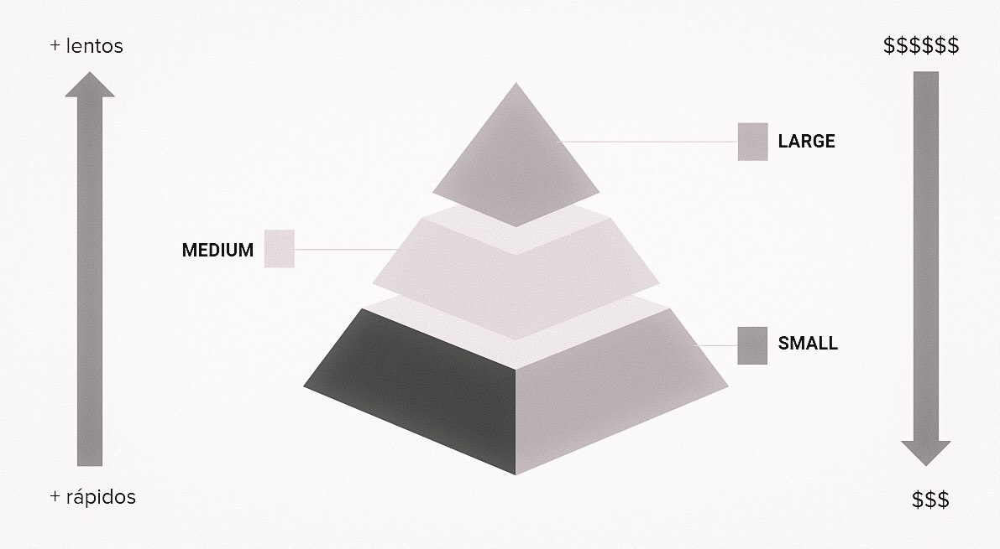

## Definindo Testes

Existem muitas definições na literatura sobre tipos e técnicas de teste, no nosso contexto eu vou usar a categorização feita pelo Google, que pode ser conferida no livro [Software Engineering at Google](https://www.amazon.com.br/Software-Engineering-Google-Titus-Winters/dp/1492082791). É uma visão que lembra a pirâmide de testes orginal citada pelo [Martin Fowler](https://martinfowler.com/articles/practical-test-pyramid.html) só que o critério de classificação utilizado é o "tamanho" do teste.

Essa categorização se refere a quantidade de processos envolvidos no teste, quanto mais processos e componentes, maior o "tamanho".

  

O Google utiliza 3 categorizações:

- Pequeno: são os testes mais contidos, geralmente são utilizados dublês de teste para evitar chamadas externas as funções testadas. São testes rápidos e determinísticos
- Médio: aqui temos testes que executam múltiplos processos mas ainda assim sem acessar componentes externos, nessa categoria entram os testes que acessam banco de dados por exemplo
- Grande: esses testes são os que necessitam de uma maior complexidade para execução, nesse momento os sistemas já estão integrados. São mais lentos e menos determinísticos.

### Pequenos

#### Testes Unitários
TODO

#### Dublês de Testes
TODO

### Médios

#### Testes de Integração
TODO

#### Testes de Contrato
TODO

### Grandes

#### Testes ponta-a-ponta
TODO

#### Testes de Desempenho
TODO

#### Testes de Compatibilidade
TODO

#### Testes Exploratórios
TODO

#### Outras Verificações

Aqui temos algumas verficações bônus que vão te ajudar a elevar a barra de qualidade do seu projeto. 

##### Análise Estática
TODO

##### Testes de Mutação
TODO

