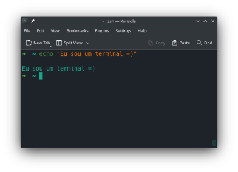

# Git Básico (Lays Rodrigues)

Git é uma ferramenta para controle de versionamento de qualquer projeto que contenha algum tipo de arquivo. 
Em nosso dia a dia de desenvolvimento o Git é uma ferramenta essencial para que possamos trabalhar em equipe e colaborar na construção de uma aplicação e com isso agregar seus principais benefícios que são: Manter o histórico do que foi desenvolvido e assim garantir a integridade do fluxo de desenvolvimento com um modelo de trabalho distribuído.


Neste capítulo trataremos do aprendizado dos seus comandos mais simples e como você deve integrá-los no seu dia a dia. 

## Por onde começar?

Normalmente para trabalharmos com o Git precisamos de um terminal. Um terminal é uma aplicação que te permite controlar recursos da sua máquina. 



No terminal nós digitamos alguns comandos que são interpretados pelo seu sistema operacional. Neste momento vamos instalar o git em nossa máquina:

### Instalação no Windows
No Windows é possível instalar o Git via um binário, que você pode [baixar aqui](https://git-scm.com/downloads) e executar a instalação, ou trabalhar com o [Windows Subsystem for Linux*](https://docs.microsoft.com/pt-br/windows/wsl/install), mais conhecido como WSL, onde o fluxo de instalação do Git é praticamente igual o do Linux que descreveremos a seguir.
> *Lembre-se que é necessário instalar e configurar o WSL em sua máquina.

### Instalação no Linux
Para instalar o Git no Linux, você pode seguir por dois caminhos: O primeiro executando a instalação pelo seu terminal e o segundo pela loja de aplicativos da sua distribuição. 
Para manter a simplicidade aqui usaremos o Ubuntu como distribuição base para realizar o processo de instalação e o comando a ser executado em seu terminal é o seguinte:

```sh
sudo apt-get install git
```

Se a sua distribuição não tiver a base Ubuntu, consulte a [documentação do Git](https://git-scm.com/download/linux) para encontrar o comando compatível com o seu sistema.

---
Após concluir a instalação do Git em sua máquina, agora vamos começar para criar nosso primeiro repositório. A seguir temos um exemplo de código, também conhecido como `snippet` com alguns comandos do git. Execute os comandos linha a linha em seu terminal para entender como fluxo de criação inicialização de um repositório git funciona e como realizar o seu primeiro _commit_.

```sh
# Comandos para criar e entrar em um diretório
mkdir meu_projeto && cd meu_conflito
# Aqui estamos iniciando o git criando a branch main
git init 
echo "# Este é meu arquivo novo" >> new_file.txt
# Aqui estamos dizendo para o git que temos um novo arquivo
git add new_file.txt
# Aqui estamos salvando este novo arquivo no git
git commit -m "Adicionando o novo arquivo"
# Com este comando conseguimos consultar o histórico de commits
git log
```

### Estados do Git
De uma forma geral podemos considerar que o Git é um gerenciador de estados. O que fizemos acima muda o estado do Git em 4 formas:

Na primeira, é quando usamos o `git init`, aqui estamos dizendo pro Git que desejamos começar um novo repositório e gerenciar as mudanças que acontecerem nesse diretório, por isso nosso diretório contém somente a pasta oculta `.git`*:


> *Entraremos em mais detalhes sobre a estrutura dessa pasta oculta em outra oportunidade, por agora, deixamos você com a [documentação oficial do Git](https://git-scm.com/docs/gitrepository-layout).

Na segunda, é quando criamos o nosso novo arquivo, o `new_file.txt`. Vemos na imagem abaixo que o nosso `new_file.txt` está listado em `Untracked files`. Neste caso o Git detecta que houve uma mudança dentro do repositório, porém o estado dessa mudança ainda não foi passado para o Git. Aqui apresentaremos o comando `git status`, que é responsável por isso mesmo, mostrar qual é o estado atual do seu repositório.


Na terceira, vamos usar o `git add new_file.txt` para dizer ao Git que queremos que ele seja responsável pela gestão do estado do nosso arquivo.


Agora notamos que nosso arquivo está listado em outra estrutura, o `Changes to be committed`. Neste estado o Git mostra que ele está pronto para gerenciar o estado do nosso arquivo, porém, ainda não demos essa responsabilidade para ele.

Na quarta e última forma, ao utilizar o `git commit -m "Adicionando o novo arquivo"`, o Git finalmente consegue adicionar o `new_file.txt` à sua estrutura e portanto agora, todas as mudanças que ocorrerem em nosso arquivo, o Git vai mostrar o antes e o depois e esperar nossas ações em relações a essas mudanças. 


### Git log
E por último, mas não menos importante, temos o `git log` que nos lista todas as mudanças de estado que "commitamos" no Git. Com este comando podemos ver todos os estados dos arquivos que salvamos em nosso repositório. E podemos ver na imagem a seguir que um `commit` contém muito mais informação além da mensagem de título que usamos na seção anterior, como a Data e Hora que esse `commit` ocorreu, o identificador dele(destacado em laranja) e quem foi o autor dessa alteração.


**Dica**: Instale o Tig para ter um outro tipo de visualização do `git log`: 
```sh
sudo apt-get install tig
```  
Para ativar o Tig basta digitar `tig` no seu terminal dentro de uma pasta com o git configurado.


### Conclusão
Até aqui nós aprendemos alguns dos comandos básicos do Git e em como usar esta ferramenta para gerenciar as mudanças dentro de nosso diretório. Porém, até agora todas essas mudanças estão em nosso computador. Como fazemos para compartilhar o nosso projeto com outras pessoas? Como salvamos o nosso trabalho em ferramentas como o Github ou Gitlab? Essas e outras perguntas responderemos no próximo capítulo. Até lá. =D