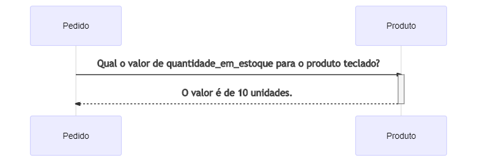
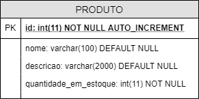
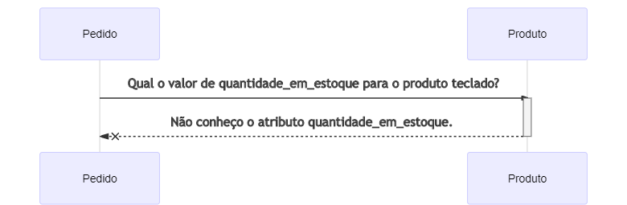
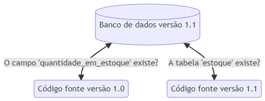
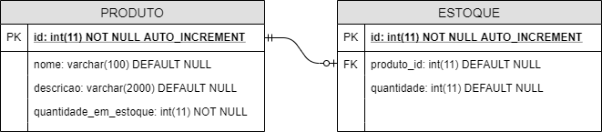

# Migrações em Banco de Dados Relacionais (Daniane Pereira Gomes)

## Introdução

Frequentemente o deploy em produção de uma aplicação envolve não só a publicação dos arquivos que compõem a aplicação (HTML, CSS, JavaScript e outros), mas também alterações na estrutura de banco de dados relacionais.

Quando tais alterações envolvem comandos DDL (Data Definition Language), por exemplo, criação, alteração e remoção de tabelas ou de campos em tabelas tais mudanças podem resultar em tempo de indisponibilidade para a aplicação.

A situação torna-se ainda mais crítica em arquiteturas distribuídas ou de micro-serviços. Imagine a seguinte situação: "*Pedido*" e "*Produto*" são sistemas separados e o serviço "*Pedido*" acessa o serviço "*Produto*" para ler o atributo ```quantidade_em_estoque``` da tabela ```produto```.  O diagrama a seguir ilustra a comunicação entre os sistemas de "*Pedido*" e "*Produto*".





Consideraremos a tabela com a seguinte estrutura:

```
CREATE TABLE `produto` (
  `id` int(11) NOT NULL AUTO_INCREMENT,
  `nome` varchar(100) DEFAULT NULL,
  `descricao` varchar(2000) DEFAULT NULL,
  `quantidade_em_estoque` int(11) NOT NULL,
  PRIMARY KEY (`id`)
);
```
O código acima é responsável por criar um tabela de banco de dados, com quatro colunas, sendo a com o nome ```id```, que não pode receber valores nulos e tem os valores incrementados automaticamente pelo banco de dados. As coluna ```nome``` e ```descricao``` podem receber valores alfanuméricos e valores nulos num máximo de 100 e 2000 caracteres respectivamente. A coluna ```quantidade_em_estoque``` pode receber valores numéricos e inteiros até o máximo de 11 algarismos e não aceita valores nulos. A instrução ```PRIMARY KEY (`id`)``` define que a coluna ```id``` é a chave primária da tabela, ou seja, um campo único para cada registro que permite identificá-lo e diferenciá-lo dos demais. 

A seguir é possível conferir uma representação visual da tabela ```produto``` seguindo a notação dos diagramas de Entidade Relacionamento.



Agora imaginamos que a equipe decidiu que não faz sentido a existência do atributo ```quantidade_em_estoque``` em ```produto``` e deseja movê-lo para outra tabela. O atributo é apagado da base de dados e o deploy do serviço "*Produto*" é realizado com sucesso. 

Entretanto, a equipe que mantém o serviço "*Pedido*" ainda não fez a alteração na leitura e deploy. Vamos supor que a equipe só conseguirá completar as alterações no código no mês seguinte e nesse momento continua a tentar ler o atributo ```quantidade_em_estoque```. Qual o resultado disso para o processo como um todo? Erros e indisponibilidade acontecerão no serviços de "*Pedido*". 



O diagrama acima demonstra a interação entre "*Pedido*" e "*Produto*", onde "*Pedido*" solicita o valor de ```quantidade_em_estoque``` mas "*Produto*" retorna um erro pois desconhece tal campo.

Imagine também que o campo ```descricao``` da tabela ```produto``` deve tornar-se obrigatório.  A pessoa responsável pela alteração escreve o *script* com alteração da estrutura da tabela modificando o campo para ```not null```. Se tudo correr bem a pipeline identifica a mudança, aplica o *script* automaticamente e o *schema* é alterado. 

Quais seriam os possíveis problemas nessa abordagem? Se a tabela já possuir registros e valores nulos, como é o caso do nosso sistema de "*Produto*", tal comando apresentará em erros.

Os exemplos citados tratam-se de **mudanças destrutivas** e devem ser tratados cuidadosamente principalmente em ambientes de produção. 

Mas então nunca deve-se fazer alterações em banco de dados de sistemas em produção? E se for realmente necessário apagar colunas de tabelas?

É óbvio que um sistema precisa de mudanças e evoluções e deixar de alterar tabelas no banco de dados não é uma opção. Para tratar disso com segurança, contamos com orientações e práticas de mercado como, por exemplo, as sugeridas por [Pramod Sadalage](http://www.sadalage.com/) e [Martin Fowler](https://martinfowler.com/) no artigo "[Evolutionary Database Design](https://martinfowler.com/articles/evodb.html)".

## Boas Práticas em Migrações
Toda alteração de banco de dados é tratada como uma migração e significa que foram desenvolvidos um ou mais *scripts* que efetuarão alterações no banco de dados, o que resultará na alteração do *schema* da aplicação.

O *schema* é espaço lógico dentro de um banco de dados que agrupa objetos como tabelas, chaves primárias, chaves estrangeiras, views, etc. É uma estrutura criadas para guardar e resgatar dados de forma mais eficaz. Tal estrutura permite a organização e agrupamento das informações de forma que estas façam sentido para a aplicação.  O *schema* define uma espécie de "molde" que será preenchido com dados. Um mesmo banco de dados pode conter vários *schemas*

Para que as alterações ocorram sem impactos destrutivos, algumas boas práticas serão abordadas a seguir.

### Versionamento de *schema*
O *schema* da aplicação deve estar junto do código fonte e demais artefatos de *software*, como testes e outros. As alterações devem fazer uso de alguma ferramenta de controle de versões como o [Git](https://git-scm.com/), para que se mantenha o rastreio de  banco de dados e sua relação com o código fonte ao longo do tempo.


### Colaboração e revisão entre a equipe
Para minimizar a possibilidade de erros, é importante que a equipe mantenha a colaboração. Ao fazer uso do Git, as alterações são submetidas à avaliação de mais membros do time antes de ser efetivamente incorporada ao banco de dados. Nesse estágio também pode haver a revisão dos scripts pela *DBA* (Database Administrator) caso exista alguém a desempenhar esse papel. Alterações destrutivas podem ser detectadas e impedidas de acontecer. O capítulo "[O que é Pull Request? (Rafael Gomes)](o_que_e_pr.md)" explica detalhadamente o processo de revisão.

### Cópias locais e reintegrações
Cada pessoa desenvolvedora deve fazer uso de uma instância de banco de dados próprio, o qual deve ser constantemente reintegrado com a versão oficial. O uso de cópias locais permite que seja feito o desenvolvimento de requisitos sem a necessidade de atualização um servidor compartilhado. 

Imagine que você deseja criar uma nova coluna ```categoria``` na tabela ```produto``` que não permite nulos. Se o seu código fonte que trata dessa nova coluna ainda não foi enviado para uma *branch* compartilhada, todas as demais usuárias desse banco de dados terão erros ao tentar inserir novos produtos.

Devido a cópias locais não demandarem que cada alteração seja enviada para um servidor compartilhado, a prática evita que alterações ainda não completamente testadas impactem e quebrem o ambiente de um time inteiro.

### Tamanho de migrações
Assim como é aconselhado que os "*Pull Requests*" sejam pequenos, as migrações também devem ser. Pequenas e constantes integrações tendem a causar menos problemas do que alterações grandes e esporádicas. 

Vamos considerar o *script* a seguir como um arquivo de migração nomeado "*V1_2_3__alteracoes_produto_e_estoque.sql*".
```
ALTER TABLE produto MODIFY descricao NOT NULL DEFAULT 'Aguardando descrição';

ALTER TABLE estoque MODIFY quantidade float(10,2) DEFAULT NUL;
```

O código acima altera a coluna ```descricao``` da tabela ```produto``` para não permitir valor nulos e usar o valor padrão "Aguardando descrição". Também altera o campo ```quantidade```da tabela ```estoque``` para aceitar valores decimais com o máximo de 10 algarismos antes da vírgula e 2 algarismos depois da vírgula.

Imagine agora que esta migração apresentou erros ao ser executada no banco de dados. Nesse caso, seria necessário a intervenção humana para depurar o *script* e verificar qual instrução precisamente não pode ser executada. O exemplo citado possui somente duas instruções e neste caso pode até ser simples encontrar qual delas é problemática. Porém, quanto maior a migração mais difícil de depurar o problema e revertê-lo.

O arquivo  "*V1_2_3__alteracoes_produto_e_estoque.sql*" então poderia ser dividido em duas partes, como exemplificado a seguir.

```
ALTER TABLE produto MODIFY descricao NOT NULL DEFAULT 'Aguardando descrição';
```
Arquivo "*V1_2_3__produto_descricao_not_null.sql*" trata somente das alterações na tabela de ```produto```.

```
ALTER TABLE estoque MODIFY quantidade float(10,2) DEFAULT NUL;
```
Arquivo "*V1_2_4__estoque_quantidade_float.sql*" trata somente das alterações na tabela de ```estoque```.


### Compatibilidade retroativa
E como evitar migrações destrutivas como as citadas nos exemplos de "*Pedido*" e "*Produto*"? 

Para que uma migração não seja destrutiva é necessário que ela possua compatibilidade retroativa, ou seja: a alteração feita no versão atual não pode fazer a versão anterior do código fonte deixar de funcionar. 

Se o *script* for aplicado no banco de dados de produção e o código fonte dos serviços que o acessam não for alterado, essa mudança não pode fazer com que o processo de ponta a ponta apresente erros. 



O diagrama acima ilustra o processo. Podemos notar que o banco de dados está na versão 1.1. Se iniciarmos um serviço com o código fonte da versão **1.0** com o banco de dados na versão **1.1**, o sistema irá buscar pelo atributo ```quantidade_em_estoque``` e deve receber uma resposta de sucesso. Já ao iniciar um serviço com o código fonte na versão **1.1**, o sistema irá buscar pela tabela ```estoque``` na versão **1.1** do banco de dados e o processo deve igualmente acontecer sem problemas. Isso se dá devido à compatibilidade retroativa de versões.

Além de permitir que sistemas externos continuem a funcionar e tenham tempo para fazer alterações, a compatibilidade retroativa é útil se for necessário executar o *rollback* de algum deploy. 

Por exemplo: numa sexta-feira às 17 horas a versão **1.1** de "*Produto*" foi liberada em produção e as migrações no banco de dados foram aplicadas. Porém, após alguns minutos de uso, os usuários começam a reportar que não conseguem criar novos produtos. A equipe decide então voltar o sistema para a versão **1.0**, que não apresentava erros e assim todos podem ir para casa e retomar a investigação na segunda-feira com mais tempo.

O banco de dados já está na versão **1.1**, pois já foram executados os *scripts* de migração. Agora imagine que a migração era destrutiva e simplesmente apagava o atributo ```quantidade_em_estoque```. O que vai acontecer ao "subir" o serviço com o código fonte da versão **1.0**? O serviço simplesmente não irá funcionar e a responsável pelo deploy precisará verificar logs, etc e investigar o porquê do problema. Se detectar a causa, ainda precisará escrever e aplicar manualmente um novo *script* para recriação do atributo que foi apagado. Além de alguém perder seu tempo de descanso para verificar algo que muito provavelmente não foi ela que causou, o sistema terá grande *downtime*, coisa que algumas aplicações não podem ter.

O cuidado com a compatibilidade retroativa previne stress, *downtime* e perdas irreversíveis de dados.

#### Remover campo em tabela
Como ficaria então nosso exemplo de remoção do atributo ```quantidade_em_estoque```? 

Tal alteração necessitaria passar por 3 etapas:

##### 1) Início das alterações
É feito o *script* inicial com a criação da nova tabela. Exemplo:
```
CREATE TABLE `estoque` (
  `id` int(11) NOT NULL AUTO_INCREMENT,
  `produto_id` int(11) DEFAULT NULL,
  `quantidade` int(11) DEFAULT NULL,
  PRIMARY KEY (`id`)
);

ALTER TABLE estoque ADD CONSTRAINT fk_estoque_produto
    FOREIGN KEY (produto_id) REFERENCES produto(id);
```
O código acima cria a tabela com nome ```estoque``` com três colunas. A primeira, nomeada ```id```, aceita números inteiros até o máximo de 11 algarismos, não aceita valores nulos e é auto incrementada pelo banco de dados. As colunas ```produto_id``` e ```quantidade```, aceitam números inteiros até o máximo de 11 algarismos e valores nulos.  

A instrução ```PRIMARY KEY (`id`)``` define que a coluna ```id``` é a chave primária da tabela, ou seja, um campo único para cada registro que permite identificá-lo e diferenciá-lo dos demais.

O comando iniciado com ```ALTER TABLE```  altera a tabela recém criada e adiciona uma restrição (```ADD CONSTRAINT```) como nome ```fk_estoque_produto```. Trata-se de uma chave estrangeira ```FOREIGN KEY```  para a coluna ```produto_id``` que faz referência à tabela ```produto```, coluna ```id```  ```(REFERENCES produto(id))``` .  Tal ligação fará com que só seja possível informar em ```produto_id``` valores existentes em ```id``` na tabela  ```produto```.



O diagrama de Entidade Relacionamento acima demonstra a interação das tabelas ```produto``` e ```estoque``` no banco de dados. O *script* que acabamos de analisar demonstra a tabela ```estoque``` representada pelo retângulo da direita. A chave estrangeira é demonstrada através da linha de ligação entre a tabela pré-existente ```produto```, representada pelo retângulo da esquerda.

##### 2) Período de transição
Durante o período de transição, tanto o campo ```quantidade_em_estoque``` quanto as informações em ```estoque``` devem ser mantidas e alimentadas. Ou seja, se o produto "Teclado" tinha 10 unidades e 1 foi vendido, ```quantidade_em_estoque``` e o teclado correspondente na tabela ```estoque``` deverão ser atualizados para o valor 9.

Da mesma forma, quando o sistema de "*Pedido*" (ou outro sistema externo)  fizer uma chamada a *"Produto"* para saber o número de teclados disponível, a resposta deve ser enviada sem erros tanto quando a requisição for feita para o campo ```quantidade_em_estoque``` quanto para a nova tabela ```estoque```.

A definição do tempo de duração da transição deve ser definida pela equipe. Quanto tempo é necessário para que todos os sistemas que "conversam" com *Produto* sejam alterados, testados e liberados em produção? Essa pergunta pode ser um bom ponto de partida para a definição da duração do período transitório.

##### 3) Finalização
Passado o período de transição, o campo ```quantidade_em_estoque``` pode ser finalmente removido, bem como o código que o mantinha.

O mesmo processo pode ser adotado para demais alterações destrutivas. Parece muito trabalho para uma alteração simples? Realmente, esse processo torna as coisas mais complexas, mas não segui-lo pode causar tempo de indisponibilidade do sistema. 

O seu cliente pode ter o sistema parado? Quantos pedidos deixarão de ser feitos e quanto dinheiro será perdido caso a API falhar? Esses são pontos a serem considerados.

#### Alterar campo para ```not null```
A instrução ```not null``` simplesmente define que determinado campo nunca pode ficar sem valores informados, ou seja, não pode aceitar nulos.  Uma alteração que parece tão simples precisa mesmo passar por todo três estágios de início, transição e fim?

Para algumas alterações, como essa por exemplo, a equipe pode decidir não aplicar os três estágios e fazer a alteração em um único *script* de migração. Porém para que este não seja destrutivo, é importante lembrar de aplicar "*update*" com valor padrão para possíveis nulos e só depois alterar a estrutura tabela. Deve-se ainda informar um valor padrão *("default")* no banco de dados para que a migração não seja destrutiva. O *script* é exemplificado a seguir.

```
UPDATE produto SET descricao = 'Aguardando descrição' WHERE descricao IS NULL;

ALTER TABLE produto MODIFY descricao NOT NULL DEFAULT 'Aguardando descrição';
```

O código acima altera todos os registros da tabela ```produto```, preenchendo o campo ```descricao``` com o valor *"Aguardando descrição"* em todos os registros que possuirem ```descricao``` nula. 

Após, altera a estrutura da tabela ```produto```, modificando o campo ```descricao``` para não aceitar valores nulos. Quando a descrição não for informada, o banco de dados preencherá  automaticamente o campo com a informação *"Aguardando descrição"*.

##  Conclusão
O processo descrito gerará uma quantidade significativa de trabalho ao desenvolvimento. Apesar de ser uma forma segura de tratar a evolução de bancos de dados relacionais, a equipe deve discutir e entrar em um acordo se essa carga extra faz realmente sentido no contexto do negócio.

Talvez para monólitos, aplicações pequenas ou que podem enfrentar períodos de indisponibilidade as etapas de transição não façam sentido. Não há certo e errado no processo de desenvolvimento. Existem sim boas práticas e orientações de mercado sobre como lidar com problemas conhecidos, mas a adoção parcial, completa ou a não adoção fica a cargo do time.
