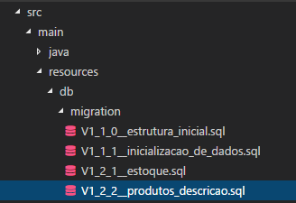

# Migrações em Banco de Dados Relacionais (Daniane Pereira Gomes)

## Introdução

Frequentemente o deploy em produção de uma aplicação envolve não só a publicação dos arquivos que compõem a aplicação (HTML, CSS, JavaScript e outros), mas também alterações na estrutura de banco de dados relacionais.

Quando tais alterações envolvem comandos DDL (Data Definition Language), por exemplo, criação, alteração e remoção de tabelas ou de campos em tabelas tais mudanças podem resultar em tempo de indisponibilidade para a aplicação.

A situação torna-se ainda mais crítica em arquiteturas distribuídas ou de micro-serviços. Imagine a seguinte situação: o serviço "*Pedidos*" acessa o serviço "*Produtos*" através de uma API e lê o atributo ```quantidade_em_estoque``` da tabela ```produto```.  Consideraremos a tabela com a seguinte estrutura:

```
CREATE TABLE `produto` (
  `id` int(11) NOT NULL AUTO_INCREMENT,
  `nome` varchar(100) DEFAULT NULL,
  `descricao` varchar(2000) DEFAULT NULL,
  `quantidade_em_estoque` int(11) NOT NULL,
  PRIMARY KEY (`id`)
);
```

Porém, em algum momento a equipe decide que não faz sentido a existência do atributo ```quantidade_em_estoque``` em ```produto``` e move-o para outra tabela. O atributo é apagado da base de dados e o deploy do serviço "*Produtos*" é realizado com sucesso. 

Entretanto, a equipe que mantém o serviço "*Pedidos*" ainda não fez a alteração na leitura e deploy. Vamos supor que a equipe só conseguirá completar o *refactoring* no mes seguinte e nesse momento continua a tentar ler o atributo ```quantidade_em_estoque```. Qual o resultado disso para o processo como um todo? Erros e indisponibilidade acontecerão no serviços de "*Pedidos*".

Imagine também que o campo ```descricao``` da tabela ```produtos``` deve tornar-se obrigatório.  A pessoa responsável pela alteração escreve o *script* com alteração da estrutura da tabela modificando o campo para ```not null```. Se tudo correr bem a pipeline identifica a mudança, aplica o *script* automaticamente e o *schema* é alterado. 

Quais seriam os possíveis problemas nessa abordagem? Se a tabela já possuir registros e valores nulos, como é o caso do nosso sistema de "*Produtos*", tal comando apresentará em erros.

Os exemplos citados tratam-se de **mudanças destrutivas** e devem ser tratados cuidadosamente principalemente em ambientes de produção. 

Mas então nunca deve-se fazer alterações em banco de dados de sistemas em produção? E se for realmente necessário apagar colunas de tabelas?

É óbvio que um sistema precisa de mudanças e evoluções e não alterar tabelas não é uma opção. Para tratar disso com segurança, contamos com orientações e práticas de mercado como, por exemplo, as sugeridas por [Pramod Sadalage](http://www.sadalage.com/) e [Martin Fowler](https://martinfowler.com/) no artigo "[Evolutionary Database Design](https://martinfowler.com/articles/evodb.html)".

## Boas Práticas em Migrações
Toda alteração de banco de dados é tratada como uma migração e significa um refactoring no banco de dados. Para que as alterações ocorram sem impactos destrutivos, algumas boas práticas serão abordadas a seguir.

### Versionamento de schema
O *schema* da aplicação deve estar junto do código fonte e demais artefatos de *software*, como testes e outros. As alterações devem fazer uso de alguma ferramenta de controle de versões como o *[Git](https://git-scm.com/)*, para que se mantenha o rastreio de  banco de dados e sua relação com o código fonte ao longo do tempo.



### Colaboração e revisão entre a equipe
Para minimizar a possibilidade de erros, é importante que a equipe mantenha a colaboração. Ao fazer uso do *Git*, as alterações são submetidas à avaliação de mais membros do time antes de ser efetivamente incorporada ao banco de dados. Nesse estágio também pode haver a revisão dos scripts pela *DBA* (Database Administrator) caso exista alguém a desempenhar esse papel. Alterações destrutivas podem ser detectadas e impedidas de acontecer.

### Cópias locais e reintegrações
Cada pessoa desenvolvedora deve fazer uso de uma instância banco de dados próprio, o qual deve ser constantemente reintegrado com a versão oficial. Essa prática evita alterações ainda não testadas impactem e quebrem o ambiente de um time inteiro. Da mesma forma, a constante reintegração permite detectar possíveis esquecimentos de *commit* de *scripts* antes de chegarem a produção.

### Tamanho de migrações
Assim como é aconselhado que os Pull Requests sejam pequenos, as migrações também devem ser pequenas. Pequenas e constantes integrações geralmente causam menos problema e trabalho do que alterações grandes e esporádicas. 

### Compatibilidade retroativa
E como evitar migrações destrutivas como as citadas nos exemplos de "*Pedidos*" e "*Produtos*"? 

Para que uma migração não seja destrutiva é necessário que ela possua compatibilidade retroativa, ou seja: a alteração feita no momento presente não pode fazer versões atuais e anteriores do código fonte quebrarem. Se o script for aplicado no banco de dados de produção e o código fonte dos serviços que o acessam não for alterado, essa mudança não pode fazer com que o processo de ponta a ponta pare de funcionar.

#### Remover campo em tabela
Como ficaria então nosso exemplo de remoção do atributo ```quantidade_em_estoque```? 

Tal alteração necessitaria passar por 3 etapas:

##### 1) Início do refactoring
É feito o script inicial com a criação da nova tabela. Exemplo:
```
CREATE TABLE `estoque` (
  `id` int(11) NOT NULL AUTO_INCREMENT,
  `produto_id` int(11) DEFAULT NULL,
  `quantidade` int(11) DEFAULT NULL,
  PRIMARY KEY (`id`)
);

ALTER TABLE estoque ADD CONSTRAINT fk_estoque_produto
    FOREIGN KEY (produto_id) REFERENCES produto(id);
```
##### 2) Período de transição
Durante o período de transição, tanto o campo ```quantidade_em_estoque``` quanto as informações na tabela ```estoque``` devem ser mantidas e alimentadas. 

As chamadas à API devem responder corretamente às requisições para ambas as fontes de dados. A definição do tempo de duração da transição deve ser definida pela equipe. 

Quanto tempo é necessário para que todos os sistemas que chamam a API de *Produtos* sejam alterados, testados e liberados em produção? Essa pergunta pode ser um bom ponto de partida para a definição da duração do período transitório.

##### 3) Finalização
Passado o período de transição, o campo ```quantidade_em_estoque``` pode ser finalmente removido, bem como o código que o mantinha.

O mesmo processo pode ser adotado para demais alterações destrutivas. Parece muito trabalho para uma alteração simples? Realmente, esse processo torna as coisas mais complexas, mas não segui-lo pode causar tempo de indisponibilidade do sistema. 

O seu cliente pode ter o sistema parado? Quantos pedidos deixarão de ser feitos e quanto dinheiro será perdido caso a API falhar? Esses são pontos a serem considerados.

#### Alterar campo para ```not null```
E a alteração de um campo para ```not null``` precisa mesmo passar por tudo isso?

Se o banco de dados não for compartilhado e alteração for simples como essa, a equipe pode decidir aplicar a alteração em um único script de migração. Porém para que este não seja destrutivo, é importante lembrar de aplicar update com valor padrão para possíveis nulos e só então alterar a tabela. A alteração deve englobar um valor default diretamente no banco de dados para que a alteração não seja destrutiva. O *script* é exemplificado a seguir.

```
UPDATE produto SET descricao = 'Aguardando descrição' WHERE descricao IS NULL;

ALTER TABLE produto MODIFY descricao DEFAULT 'Aguardando descrição';
```

##  Conclusão
O processo descrito gerará uma quantidade significativa de trabalho ao desenvolvimento. Apesar de ser uma forma segura de tratar a evolução de bancos de dados relacionais, a equipe deve discutir e entrar em um acordo se essa carga extra faz realmente sentido no contexto do negócio.

Talvez para monólitos, aplicações pequenas ou que podem enfrentar períodos de indisponibilidade as etapas de transição não façam sentido. Não há certo e errado no processo de desenvolvimento. Existem sim boas práticas e orientações de mercado sobre como lidar com problemas conhecidos, mas a adoção parcial, completa ou a não adoção fica a cargo do time.
