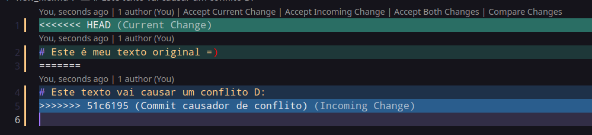
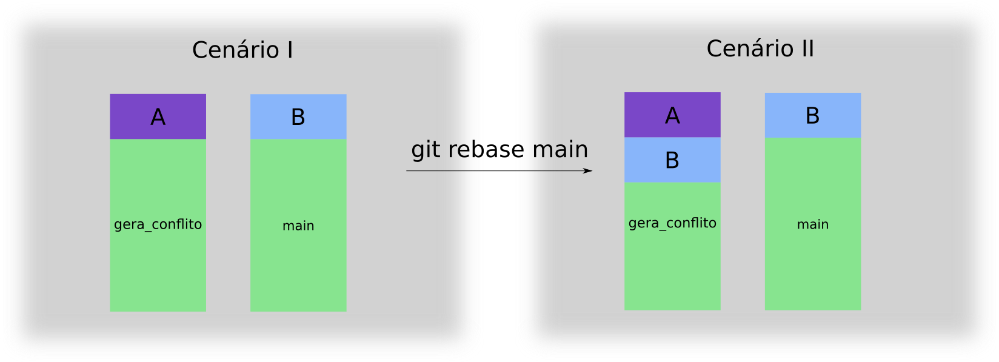
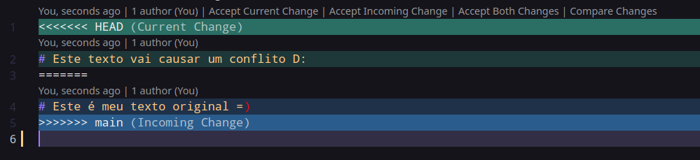

# Como tratar conflitos no Git? (Lays Rodrigues)

Em nosso dia a dia de desenvolvimento inevitavelmente vamos ter que lidar com conflitos no Git.
Segundo a definição do [Github Docs](https://docs.github.com/en/github/collaborating-with-pull-requests/addressing-merge-conflicts/about-merge-conflicts) um conflito "é criado quando você faz um _merge_ entre _branches_ que possuem commits concorrentes e o Git precisa da sua ajuda para decidir quais alterações incorporar na _merge_ final."
Ou seja, você alterou arquivos em sua _branch_ e ao tentar fazer o merge na _main_ ou em outra _branch_, os arquivos que sofreram alteraçães também foram modificados na mesma linha ou totalmente por outra pessoa e portando você precisa decidir se vai manter suas alterações ou as de terceiros.

## Como causar confitos?

Primeiramente vamos criar um cenário de conflito e analisá-lo.

Executaremos em nosso terminal os seguintes comandos:

```sh
# Comandos para criar e entrar em um diretório
mkdir meu_conflito && cd meu_conflito
# Aqui estamos iniciando o git criando a branch main
git init 
echo "# Este é meu arquivo novo" >> new_file.md
# Aqui estamos dizendo para o git que temos um novo arquivo
git add new_file.md
# Aqui estamos salvando este novo arquivo no git
git commit -m "Adicionando o novo arquivo"
# Este comando cria uma nova branch com o nome gera_conflito
git checkout -b gera_conflito 
echo "# Este é meu texto original =)" >> new_file.md
# Aqui estamos dizendo para o git que temos alteração em nosso arquivo 
git add new_file.md
# Aqui estamos salvando as alterações do arquivo no git
git commit -m "Atualizando o arquivo"
# Agora estamos voltando a nossa branch inicial
git checkout main
echo "# Este texto vai causar um conflito D:" >> new_file.md
# Aqui estamos realizando uma alteração passível de gerar conflito
git commit -m "Commit causador de conflito"
# Voltemos a nossa branch de trabalho
git checkout gera_conflito

# Comando para realizar um rebase entre gera_conflito e a main
git rebase main
# Comando para realizar um merge entre gera_conflito e a main
git merge main
```

### Git Rebase
No cenário apresentado na imagem abaixo, simulamos o evento de _rebase_ entre duas _branches_. Este exemplo foi feito no VSCode que possui ferramentas que nos auxiliam no tratamento de conflitos.

**Fluxo representando o git rebase**


Agora vamos detalhar os elementos presentes nesta imagem.

O bloco entre `<<<<<<< HEAD (Current Change)` e o `=======` destacado em tons de **verde**, representa as alterações pertencentes ao commit na sua _branch_ atual, e o bloco a partir deste último até `>>>>>>> (Commit causador de conflito) (Incoming Change)` destacado em tons de **azul** representa as alterações que o _commit_ da _branch_ para a qual você está realizando o _rebase_ possui.
Resumidamente o comando `rebase` avalia qual o último _commit_ as duas _branches_ possuem em comum, e a partir desse puxa todos os _commits_ na _branch_ `main` e depois que puxar todos esses _commits_, adiciona os _commits_ relacionados a `gera_conflito`. 

No diagrama abaixo temos representados dois cenários. O Cenário I representa nosso estado atual entre as _branches_: Temos o bloco _A_ que concentra o grupo de _commits_ realizados na _branch_ `gera_conflito`, e no bloco _B_ o grupo de _commits_ realizados na _branch_ `main`. No segundo cenário representamos o que seria o fluxo de sucesso, onde conseguiríamos trazer tranquilamente as mudanças da `main` para `gera_conflito`, mas como estamos simulando o cenário de conflito, os blocos _A_ e _B_ contém mudanças conflitantes entre si.


### Git Merge
Alternativamente ao comando _rebase_ temos o comando _merge_, e a simulação do nosso cenário de conflito vem a seguir:

**Fluxo representando o git merge**


Visualmente a diferença está na mensagem destacada no bloco **azul**, no cenário de _rebase_ é destacado qual é o _commit_ que causou o conflito, e no cenário de _merge_ é destacado qual o _branch_ que causou o conflito.

### Ok, o que eu faço agora?

Em ambos os cenários temos dois _commits_ que editaram a mesma linha de arquivo, e o _git_ não sabe o que fazer, já que como mostra o diagrama da seção anterior, os dois _commits_ estão no mesmo nível e sobreescreveram o mesmo arquivo. Portanto é nos dada a opção de qual caminho escolher: Se eu permaneço com a alteração do meu _branch_ `gera_conflito` ou se eu escolho manter a alteração da _branch_ `main`.

Neste caso vou permanecer com as alterações que vieram da `main`, portanto selecionei nas opções do meu editor o fluxo do `Accept Incoming Change` ou "Aceitar a mudança recebida", que diz para o meu editor que eu gostaria de aceitar as alterações que estão vindo da _branch_ `main`, onde automaticamente todo o texto entre as linhas 1 e 3, e a linha 5 serão apagados, restando somente a linha 4. Se o seu editor não possuir esse tipo de ferramenta auxiliar, basta você deletar as linhas mencionadas e salvar o arquivo.

Existem mais dois fluxos que você pode escolher no momento de tratar o seu conflito:
- `Accept Current Change` ou "Aceitar a mudança atual", que em nosso caso apagaria a linha 1 e da 3 em diante.
- `Accept Both Changes` ou "Aceitar ambas as mudanças", que em nosso caso apagariam as linhas 1, 3 e 6.

O fluxo ideal varia para cada tipo de cenário deve ser avaliado na correção do conflito.

### Vamos resolver o conflito

Após salvar o arquivo, vamos ao terminal e vamos dizer para o _git_ que você já resolvemos o nosso conflito com os seguintes comandos:

```sh
git add new_file.md
# No cenário do rebase
git rebase --continue
# No cenário do merge
git merge --continue
```

Como dissemos no início deste capítulo, o tratamento de conflitos é inevitável em nossa jornada de solucionadores de problemas. Cada conflito é único e existem algumas formas de criá-los e resolvê-los. Esperamos que este capítulo tenha lhe dado uma base inicial para entender como nós podemos juntar alterações feitas em _branches_ diferentes e o que fazer quando o conflito surgir.

Fique a vontade para submeter um _Pull Request_ para melhorar ou adicionar o conteúdo descrito aqui. Só cuidado com o conflito!

> Para mais informações sobre a diferença entre _rebase_ e _merge_ consulte [este link](https://www.atlassian.com/git/tutorials/merging-vs-rebasing). 